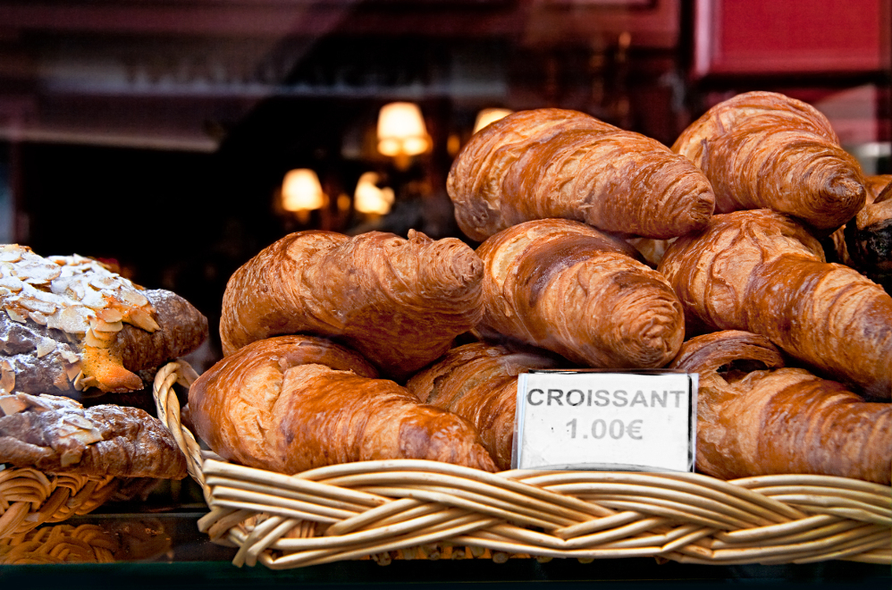
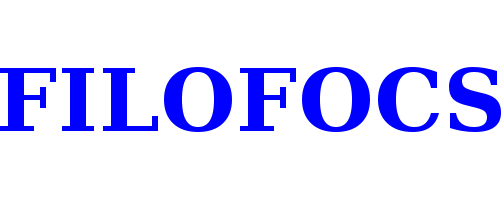
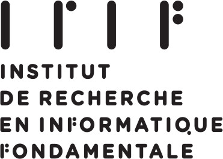
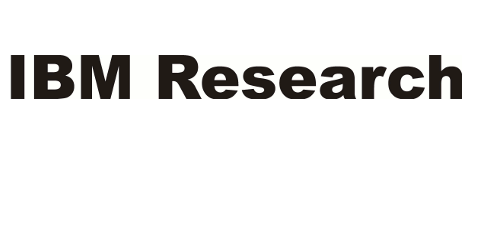

---
# You don't need to edit this file, it's empty on purpose.
# Edit theme's home layout instead if you wanna make some changes
# See: https://jekyllrb.com/docs/themes/#overriding-theme-defaults
layout: default
title: Foundations of Computer Science 2018
---
<meta name="viewport" content="width=device-width, initial-scale=1">
<!-- <link rel="stylesheet" href="https://www.w3schools.com/w3css/4/w3.css"> -->

  
  
  
  
  
  
  
  
   
  
<button class="w3-button w3-black w3-display-left" onclick="plusDivs(-1)">&#10094;</button>
<button class="w3-button w3-black w3-display-right" onclick="plusDivs(1)">&#10095;</button>

 
FOCS 2018 is sponsored by the IEEE Computer Society Technical Committee on Mathematical Foundations of Computing, with additional sponsorship from the CNRS (French National Center for Scientific Research), DIM Math Innov of the Île de France Region, and other sponsors as listed by the logos below.

### Important Dates:
- Submission deadline: 5:00pm PDT, April 6, 2018.
- Notification: by July 1, 2018.
- Final version of accepted papers due: August 15, 2018.

### Contact Information:

- General Chair: Yuval Rabani, The Hebrew University of Jerusalem
- Program Chair: Mikkel Thorup, University of Copenhagen
- Local Arrangements Committee: Sophie Laplante; Alessandro Luongo; Adi Rosén (chair), IRIF (CNRS & U. Paris Diderot). [Email: focs2018@irif.fr](mailto:focs2018@irif.fr). In cooperation with 

### Sponsors:

 
<table class="tg">

<tr>
<td class="tg-031e">    </td>
<td class="tg-031e">   </td>
</tr>

<tr>
<td class="tg-031e">     </td>

<td class="tg-031e">     </td>
</tr>

 

<tr>
   
<td class="tg-031e">   </td>

</tr>

<tr>
<td class="tg-031e"> </td>
<td class="tg-031e">    </td>
</tr>

<tr>
<td class="tg-031e">    </td>
<td class="tg-031e">    </td>
</tr>

 
<tr>
<td class="tg-031e">    </td>
<td class="tg-031e">   </td>
</tr>

</table>

[cnrs]: assets/cnrs.png
[irif]: assets/irif.svg
[math]: assets/mathinnov.jpg
[ieee1]: assets/ieee1.png
[ibm]: assets/IBM_logo.pdf
[BARC]: assets/BARC_logo.png
[dakini]: assets/dakini_logo.png
[microsoft]: assets/microsoft.jpg
[google]: assets/google.png

