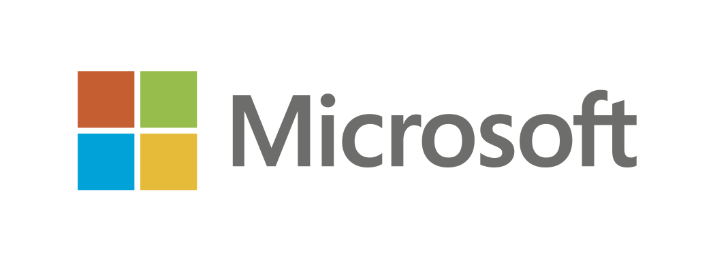
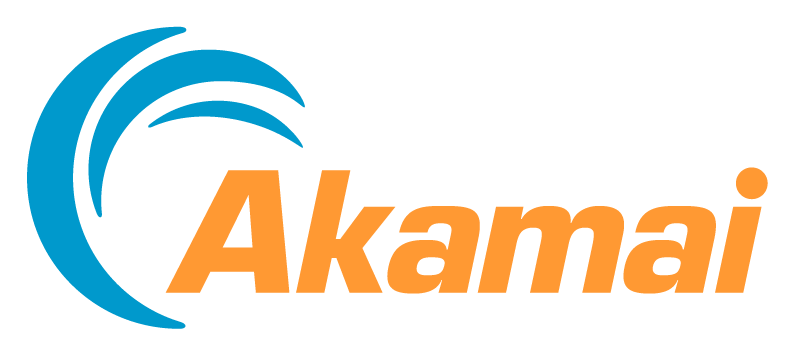
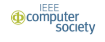

---
# You don't need to edit this file, it's empty on purpose.
# Edit theme's home layout instead if you wanna make some changes
# See: https://jekyllrb.com/docs/themes/#overriding-theme-defaults
layout: default
title: Foundations of Computer Science 2019
---
<meta name="viewport" content="width=device-width, initial-scale=1">
<!-- <link rel="stylesheet" href="https://www.w3schools.com/w3css/4/w3.css"> -->

  

  <!--  -->
  <!--  -->
  <!--  -->

  <!--  -->

<button class="w3-button w3-black w3-display-left" onclick="plusDivs(-1)">&#10094;</button>
<button class="w3-button w3-black w3-display-right" onclick="plusDivs(1)">&#10095;</button>

 
FOCS 2019 is sponsored by the IEEE Computer Society Technical Committee on Mathematical Foundations of Computing.

### Updates
- Sign up for <a href="http://bit.ly/FOCS19LUNCH">junior/senior mentoring lunches</a>!  Instructions at the link.  
- Preliminary information about <a href="{{ site.url }}/workshops/">workshops and tutorials</a> has been posted, including <a href="https://sites.google.com/view/focs2019tributetoshafigoldwass/home">ShafiFest</a>!
- The program for the main conference has been posted!  There will also be workshops on Saturday, November 9, with details TBD, and a welcome reception at 6pm on Saturday.
- Information about the <a href="{{ site.url }}/celebration/">60th FOCS celebration</a> has been posted!
- Information about <a href="{{ site.url }}/travel_grants/">travel awards</a> for students and postdocs is available.
- <a href="{{ site.url }}/registration/">Registration</a> and <a href="{{ site.url }}/hotel/">hotel reservations</a> are now open.
- <a href="{{ site.url }}/accepted/">Accepted papers</a> have been posted.

### Important Dates:
- Conference: November 9 - 12, 2019
- ~~<a href= "{{ site.url }}/registration/">Early Registration</a>: October 8, 2019~~
- ~~<a href="{{ site.url }}/travel_grants/">Travel Awards</a>: September 15, 2019~~
- ~~<a href="{{ site.url}}/posters/">Job Market Posters</a>: September 6, 2019~~
- Regular Papers
  - ~~Submission deadline: April 5, 2019, 3:00PM PDT (<a href="https://focs19.cs.utexas.edu/">submit here</a>)~~
  - ~~Notification: by July 1, 2019~~
  - ~~Final version of accepted papers due: mid-August, 2019~~
<!-- - <a href="{{ site.url }}/tota/">Test of Time Award</a> Nomination deadline: April 23, 2019 -->

### Organization:

- General Chair: Yuval Rabani (The Hebrew University of Jerusalem)
- Program Chair: David Zuckerman (University of Texas at Austin)
- Local Arrangements Chair: Michael Dinitz (Johns Hopkins University)
- SafeToC (anti-harassment) advocates: Sandy Irani (UC Irvine) and Martin Farach-Colton (Rutgers University)
- 60th anniversary celebration committee: Ronitt Rubinfeld (MIT, chair), Avrim Blum (TTI-Chicago)
- Job-market poster session co-chairs: Shubhangi Saraf (Rutgers University), Ravi Kumar (Google)
- Workshop and Tutorial co-chairs: Robert Kleinberg (Cornell University) and Maria-Florina Balcan (Carnegie Mellon University)

### Sponsors:

<table class="tg">
<tr>
<td class="tg-031e">    </td>
<td class="tg-031e">    </td>
</tr>
<tr>
<td class="tg-031e">    </td>
<td class="tg-031e">    </td>
</tr>
<tr>
<td class="tg-031e">    </td>
<td class="tg-031e">   </td>
</tr>
<tr>
<td class="tg-031e">    </td>
</tr>
</table>

[cnrs]: assets/cnrs.png
[irif]: assets/irif.svg
[math]: assets/mathinnov.jpg
[ieee1]: assets/ieee1.png
[ibm]: assets/IBM_logo.pdf
[BARC]: assets/BARC_logo.png
[dakini]: assets/dakini_logo.png
[microsoft]: assets/microsoft.jpg
[google]: assets/google.png
